Embarking on the journey of training a pallet model requires meticulous preparation of the dataset. In this guide, we'll walk through the crucial steps from collecting images to organizing data for effective training. Let's dive in!

Collecting Images for Training
---
Before you begin training your pallet model, assemble a dataset of images relevant to your objectives. The size of the dataset depends on the complexity of your task and the desired accuracy level. Whether it's 100, 500, or 10,000 images, ensure they cover a diverse range of scenarios your model may encounter.

Annotation with makesense.ai
---
Now that you've gathered your images, the next step is to annotate them using a tool like makesense.ai, ensuring compatibility with the YOLO framework. Follow these steps:

__Draw Bounding Boxes:__  
Annotate your images by drawing bounding boxes around the pallets. Make sure each box accurately encapsulates the pallet in the image.

__Assign Labels:__  
Assign appropriate labels to the annotated bounding boxes. For instance, label the bounding box as 'pallet' to instruct the model on what it should identify.

__Export Annotations for YOLO:__  
When exporting annotations, make sure the format is compatible with YOLO's expectations. YOLO typically uses a text file for each image, listing the class label and the coordinates of the bounding box relative to the image size.

Organizing Your Dataset
---
Create a folder structure for your dataset. Within a main folder named train_data, include two subfolders named images and labels. It's crucial to name these folders exactly as "images" and "labels" for consistency.  

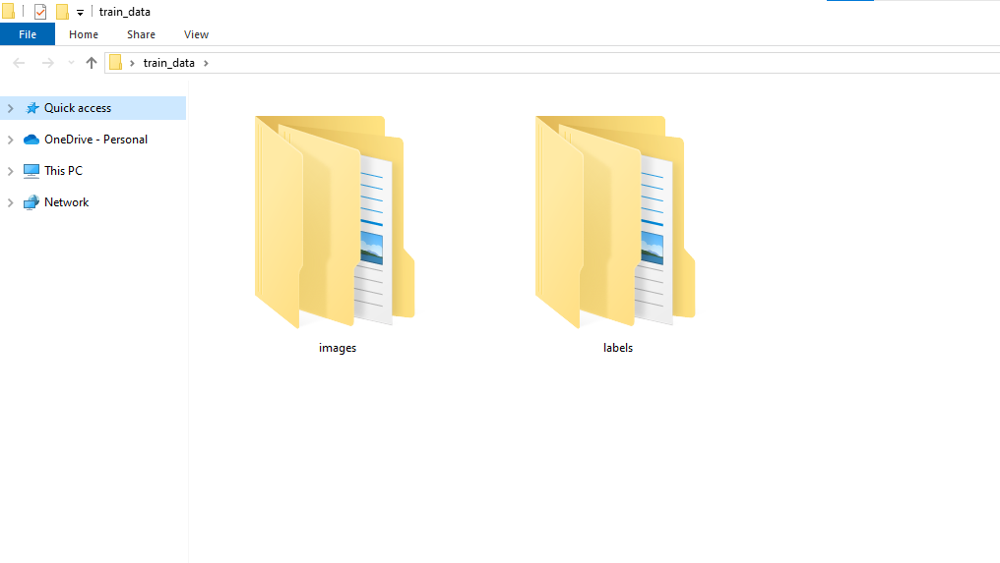

__Training Dataset:__  
Purpose: Train the model to recognize patterns, make predictions, and adjust parameters.  
Size: This subset is usually the largest, providing diversity for the model to generalize effectively.

__Validation Dataset:__  
Purpose: Evaluate the model's performance during training, fine-tune hyperparameters, and serve as an independent dataset.  
Size: Smaller than the training set to monitor performance without compromising efficiency.

Split both the images and labels folders into corresponding training and validation sets, ensuring that the subsets align.  
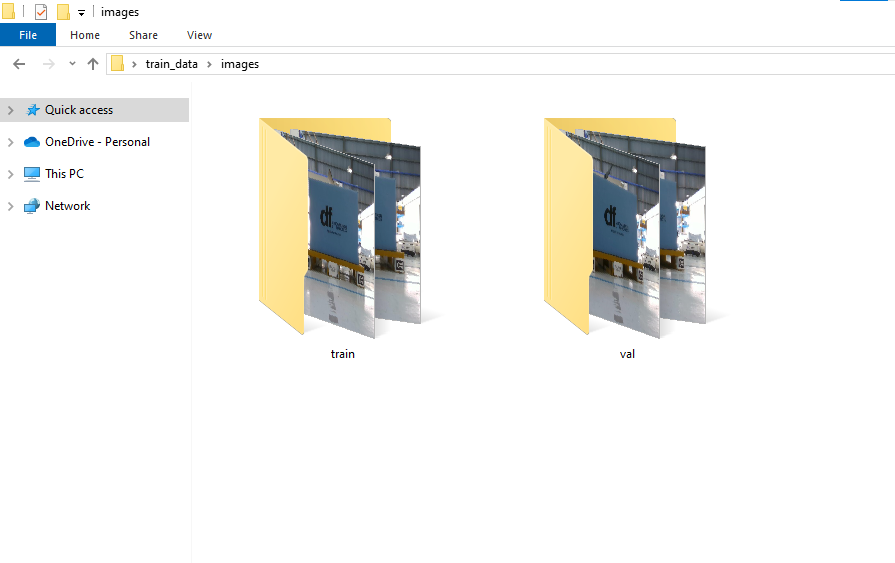

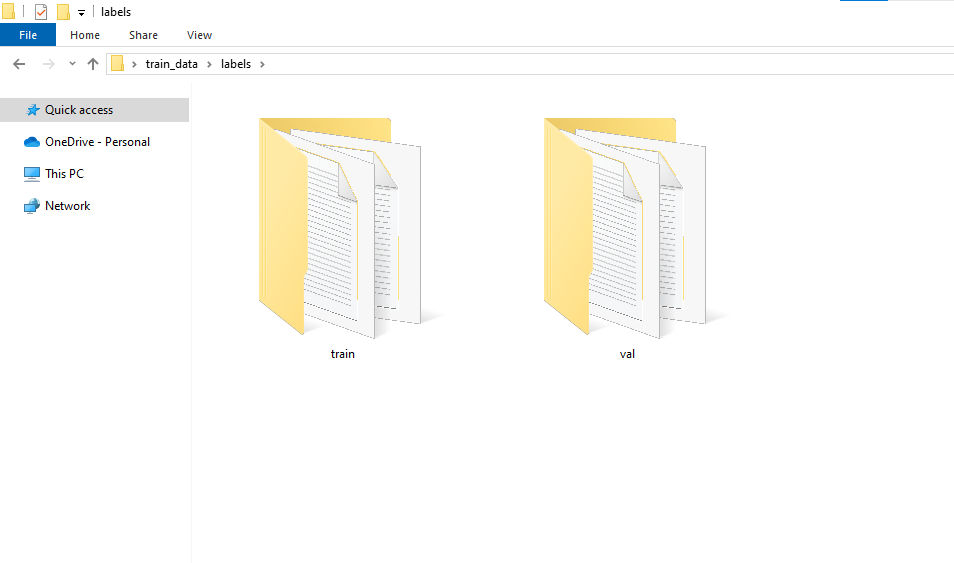

__images:__ Store the images you gathered for training in this folder.  
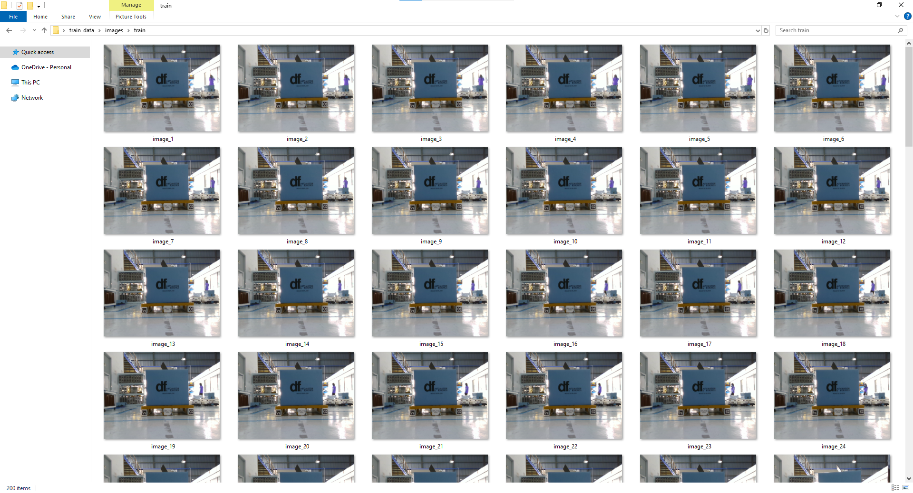

__labels:__ Place the annotation files generated by makesense.ai in this folder.  
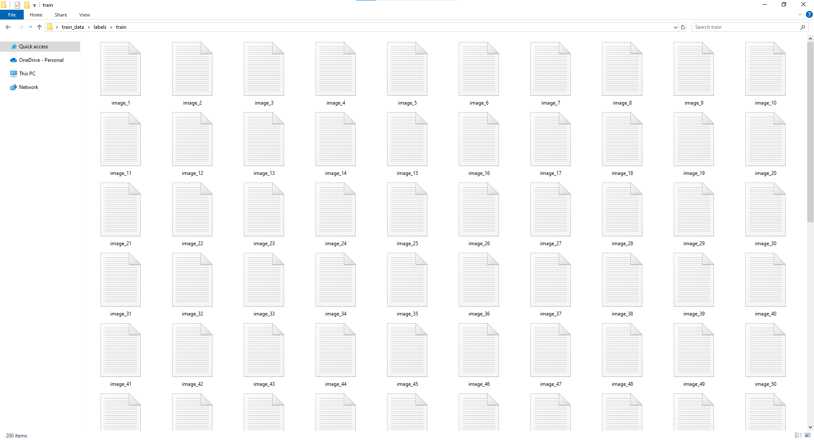

Prepare YOLO Configuration File
---
To seamlessly integrate your prepared dataset with YOLO, you need to create or modify a configuration file in YAML format.  

Access YOLO Official GitHub Repo:
  - Go to the official YOLO GitHub repository: https://github.com/ultralytics/yolov5

  - Navigate to the data directory.

Select a YAML Template:

  - Choose a YAML template as a starting point. For instance, you can use coco128.yaml as a base.

Modify YAML Configuration:
  - Open the selected YAML file (e.g., coco128.yaml) and modify the following parameters:

    - train and val paths to point to your images and labels folders within the train_data directory.
   
    - names to include the names of your classes (e.g., 'pallet').

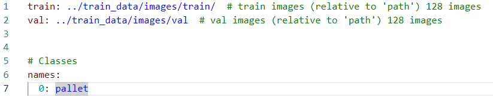

Setting up GPU Environment on Google Colab
---

For training your YOLOv5 model, Google Colab provides a convenient environment with free access to a GPU.

__Access the Google Colab Notebook:__  
Go to the following link to open the YOLOv5 Google Colab notebook  
https://colab.research.google.com/github/ultralytics/yolov5/blob/master/segment/tutorial.ipynb  

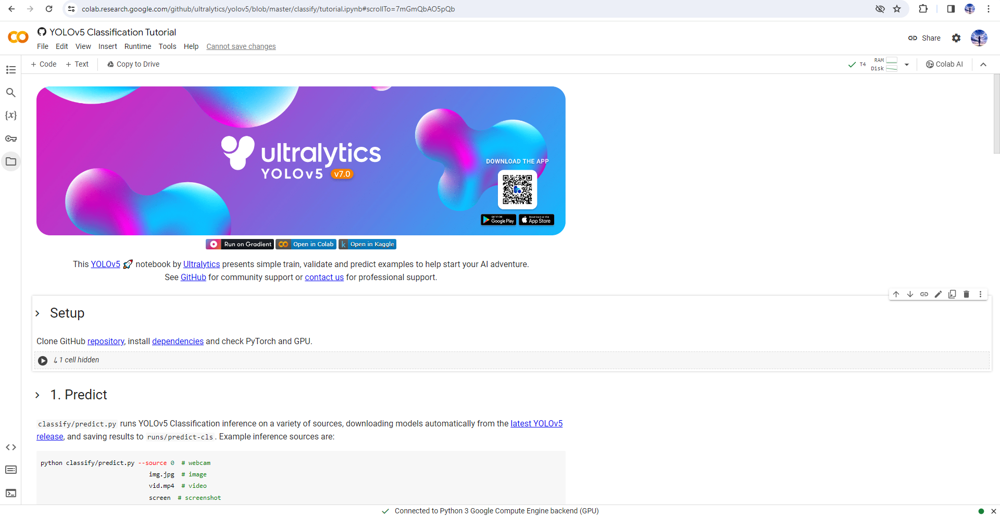

__Focus on Setup and Training Sections:__  
In the Colab notebook, focus on the sections related to setup and training. You can ignore other parts if they are not relevant to your specific task.  

__Run Setup Code:__  
Execute the code segments in the setup section by clicking the "Run cell" button next to each code cell. This will clone the official YOLOv5 repository and set up the necessary environment.  
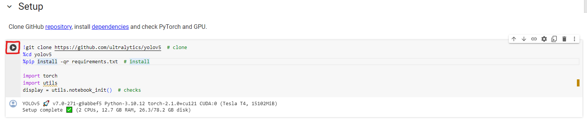

__Verify Repository Clone:__
After running the setup code, check the file list in the Colab environment to ensure that the YOLOv5 repository has been successfully cloned.  
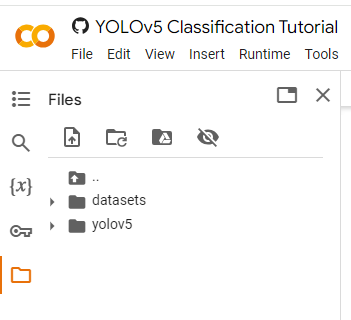

__Upload YAML Configuration File:__  
Use the file upload feature in Google Colab to upload the YAML configuration file (custom_dataset.yaml) you prepared earlier. Place the file in the data directory within the YOLOv5 folder.
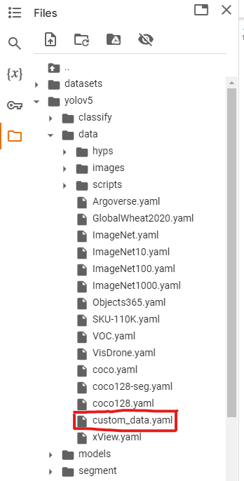

__Upload Dataset in a Zip File:__  
Similarly, upload your prepared dataset in a zip file. Ensure that the zip file includes the images and labels folders within the train_data directory. Use the file upload feature in Google Colab to upload the zip file.
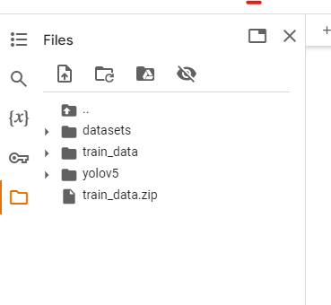

__Unzip the Dataset:__  
Run the following code cell to unzip the dataset, replace 'your_dataset.zip' with the actual name of your uploaded zip file  
!unzip -q ../your_dataset.zip -d ../  

Training Process
---

Navigate to the training section in the Google Colab notebook, where you'll find a code cell with the training command. 

__Modify and Run Training Command__  
Modify the command based on your preferences, adjusting parameters such as image size, number of epochs, batch size, etc. For example:  
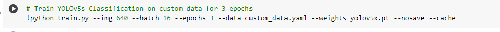  
Here, adjust --img-size, --batch-size, --epochs, and --data based on your specific requirements. The --weights parameter specifies the starting weights for training; you can start with a pre-trained YOLOv5 model.  
Run the cell to start the training process.  

__Monitor Training Progress__  
As the training progresses, Google Colab will display real-time updates on the training metrics and loss. You can monitor the progress and make adjustments if necessary.  
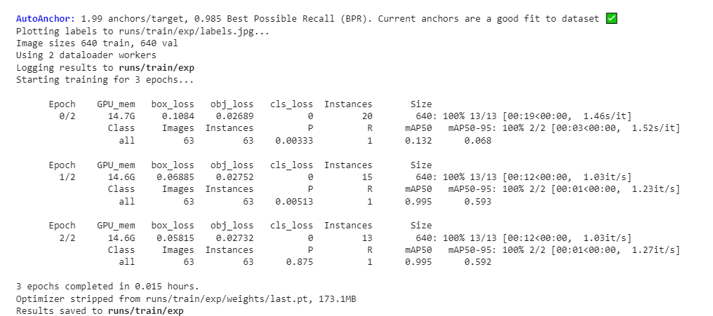

__Access Trained Model__  
Upon successful completion of training, your trained model will be stored in the weights folder within the exp (experiment) folder under the runs directory. Specifically, you will find the last.pt file, which represents your pre-trained model.  
Navigate to the runs/exp/your_experiment_folder/weights/ directory to access the trained model weights.
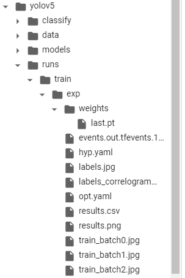