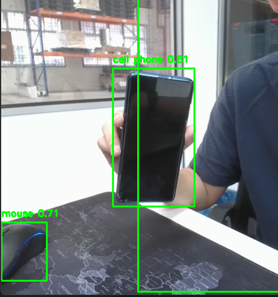

In the realm of autonomous systems, the use of cutting-edge technologies plays a pivotal role in ensuring efficient and safe operations. This article delves into the integration of YOLO (You Only Look Once) object detection and CSRT (Discriminative Correlation Filter with Channel and Spatial Reliability) tracking to empower an Automated Guided Vehicle (AGV) with advanced capabilities.

YOLO for Real-Time Object Detection:
---
In the realm of autonomous systems, the use of cutting-edge technologies plays a pivotal role in ensuring efficient and safe operations. This article delves into the integration of YOLO (You Only Look Once) object detection and CSRT (Discriminative Correlation Filter with Channel and Spatial Reliability) tracking to empower an Automated Guided Vehicle (AGV) with advanced capabilities.

YOLO for Real-Time Object Detection:
---
The AGV, constrained by the absence of an embedded GPU, necessitated the selection of a lightweight yet powerful object detection tool. YOLO, renowned for its efficiency in recognizing and locating objects in real-time, emerged as the optimal choice. Specifically, YOLO v7 tiny was chosen for its ability to efficiently run on the AGV's Industrial Personal Computer (IPC).By setting a threshold of 60%, we establish a criterion for inclusion, ensuring that only detections with confidence levels surpassing this threshold are considered.The 60% confidence threshold proves to be a strategic measure in achieving this goal. By filtering out detections with lower confidence scores, we mitigate the risk of false positives and enhance the overall reliability of the AGV's decision-making process.

Data Acquisition with Realsense Camera:
---
To facilitate the object detection process, a Realsense camera was seamlessly integrated into the AGV's system. This camera not only provided high-quality frames but also offered depth sensing capabilities, enriching the robot's perception of its environment. The marriage of YOLO with Realsense elevated the AGV's ability to detect and understand its surroundings, thereby enhancing its operational awareness.

CSRT Tracker: AGV's Smart Eyes:
---
Following the successful implementation of YOLO for object detection, the next challenge was to maintain continuous tracking of the detected objects, with a focus on the nearest person. The chosen solution was the CSRT Tracker from the OpenCV (cv2) library. This tracker demonstrated intelligence by dividing the object into color and space components, enabling it to adapt effectively to changes in size or appearance. Continuous tracking is crucial for dynamic environments, allowing the AGV to respond proactively to changes and ensuring a seamless interaction with its surroundings.

How CSRT Tracker Works:
---
The CSRT Tracker creates a confidence map, providing insights into the object's location in subsequent frames. This mechanism proves invaluable when dealing with scenarios where objects may disappear or undergo significant changes. In the context of the AGV, the CSRT Tracker functions as the robot's eyes, ensuring constant vigilance on the closest person it detects.

AGV's Navigation With CSRT Tracker:
---
As the AGV navigates its environment, the CSRT Tracker serves as a crucial element in maintaining a watchful eye on the detected person. Continuously predicting the person's trajectory, the CSRT Tracker enables the AGV to proactively adjust its course, ensuring a smooth and secure interaction with its surroundings.

Conclusion:
----
The fusion of YOLO object detection and CSRT tracking empowers AGVs with a potent combination of real-time recognition and dynamic tracking capabilities. In the absence of a dedicated GPU, the choice of YOLO v7 tiny proves to be a pragmatic solution, while the integration of the Realsense camera elevates the AGV's perception. The CSRT Tracker acts as the AGV's intelligent eyes, ensuring seamless navigation and interaction with the nearest detected person. This amalgamation of technologies paves the way for enhanced autonomy and efficiency in AGV operations.

Data Acquisition with Realsense Camera:
---
To facilitate the object detection process, a Realsense camera was seamlessly integrated into the AGV's system. This camera not only provided high-quality frames but also offered depth sensing capabilities, enriching the robot's perception of its environment. The marriage of YOLO with Realsense elevated the AGV's ability to detect and understand its surroundings, thereby enhancing its operational awareness.

CSRT Tracker: AGV's Smart Eyes:
---
Following the successful implementation of YOLO for object detection, the next challenge was to maintain continuous tracking of the detected objects, with a focus on the nearest person. The chosen solution was the CSRT Tracker from the OpenCV (cv2) library. This tracker demonstrated intelligence by dividing the object into color and space components, enabling it to adapt effectively to changes in size or appearance. Continuous tracking is crucial for dynamic environments, allowing the AGV to respond proactively to changes and ensuring a seamless interaction with its surroundings.

How CSRT Tracker Works:
---
The CSRT Tracker creates a confidence map, providing insights into the object's location in subsequent frames. This mechanism proves invaluable when dealing with scenarios where objects may disappear or undergo significant changes. In the context of the AGV, the CSRT Tracker functions as the robot's eyes, ensuring constant vigilance on the closest person it detects.

Addressing Tracking Challenges: Implementing Intelligent Object Verification in AGV Operations 
---
In the realm of autonomous systems, where reliability is paramount for Automated Guided Vehicles (AGVs), the integration of YOLO object detection and CSRT tracking is enhanced with an intelligent object verification mechanism to address occasional tracking challenges. This mechanism continuously checks the characteristics of the tracked object, ensuring alignment with human features. When discrepancies or tracking errors are detected, the AGV dynamically halts tracking, initiates a new detection process to identify the nearest person, and then reinitializes the CSRT Tracker for optimal performance. This adaptive approach not only enhances tracking precision but also contributes to the safety and efficiency of AGV operations by preventing the tracking of non-human objects and minimizing the risk of unintended interactions in dynamic environments.

Conclusion:
----
The fusion of YOLO object detection and CSRT tracking empowers AGVs with a potent combination of real-time recognition and dynamic tracking capabilities. In the absence of a dedicated GPU, the choice of YOLO v7 tiny proves to be a pragmatic solution, while the integration of the Realsense camera elevates the AGV's perception. The CSRT Tracker acts as the AGV's intelligent eyes, ensuring seamless navigation and interaction with the nearest detected person. This amalgamation of technologies paves the way for enhanced autonomy and efficiency in AGV operations.