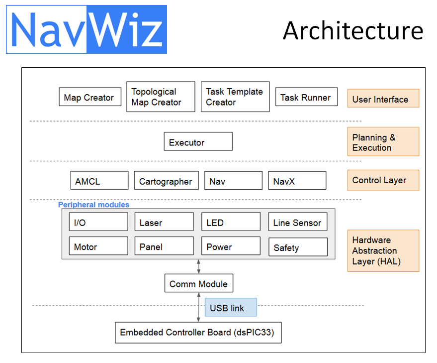

Before we first designed our *Zalpha* AGV, we have delivered quite a number of customized AGV solutions. Learning from our past experience, we decided that we need a software which is flexible to different customizations, yet does not demand our programmers to be on-site to setup the AGVs.

The first release of the software (which was later named as NavWiz) was developed within 3 months by our software team, in early 2016. It greatly simplifies the setup of the AGV into 3 steps:

1. Paste the magnetic tape on the floor.
2. Draw the map layout in NavWiz map editor.
3. Draw the operation flowchart in NavWiz task template editor.

After the setup, the user will be able to execute task from the Task Runner app on the AGV panel.

The result is a software which is easy to program and scalable because we can now hire technicians to setup our AGVs.

The diagram below captures the software archictecture of NavWiz.

The top layer is the presentation or user interface layer, which consists of the map creator, map editor, task template editor and task runner.

The second layer from top is the execution layer, which takes the user input (including the flowchart) from the layer above, and translates it into sub-actions for the control layer below.

The third layer is the control layer. Here the *AMCL* module provides a computed location of the AGV based on several sensor sources, and the *Cartographer* module provides map generation service. Meanwhile, the *Nav* and *NavX* modules control the movement of the AGV in tracked and trackless mode respectively.

The hardware abstraction layer comes next in the structure. It comprises the peripheral modules used to control the low-level stuff of the hardware, including *I/O*, *Laser*, *Motor*, *Power*, *Safety*, etc.
These modules can be easily swapped to integrate with different hardware. For example, the initial motor node is developed for *Zalpha* AGV with a payload of up to 500kg. When we developed our *Titan* AGV with a 1.5-tonne payload, we simply need to rewrite a new motor node to control a different motor.

While the top four layers execute within an industrial computer, the bottommost layer lies in the firmware of our embedded circuit board. It communicates with its upper layer through the USB link.

Some might be curious about the programming languages and framework we use. Most parts of the software utilize the [ROS](http://www.ros.org/) framework. For the user interface layer, we use the [Django](http://www.djangoproject.com) framework as the backend, and Javascript and HTML in the frontend. The executor is coded in Python, and the remaining control and peripheral layers are written in C++.
